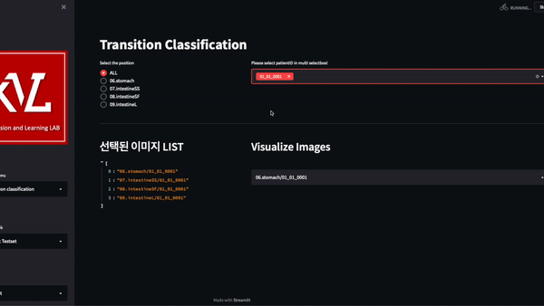
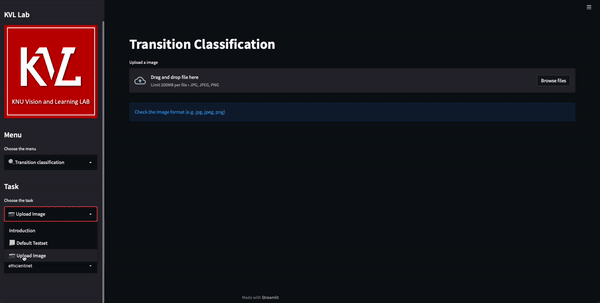
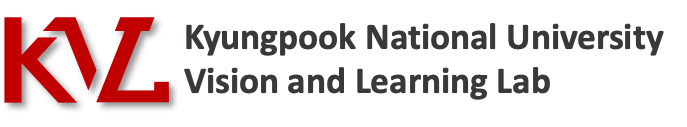

# CapAI Web Demo
- This project demonstrates object detection models([YOLOv5](https://github.com/ultralytics/yolov5), [Swin Transformer](https://github.com/SwinTransformer/Swin-Transformer-Object-Detection)) and classification model([EfficientNet](https://github.com/lukemelas/EfficientNet-PyTorch), [ResNeXt](https://arxiv.org/pdf/1611.05431.pdf)) into an interactive [Streamlit](https://streamlit.io) app.

<br/>

# Getting Started
## Run
```bash
# To run this demo
$ git clone https://github.com/seareale/web-demo-streamlit.git
$ cd web-demo-streamlit
$ pip install -r requirements.txt
$ streamlit run main.py
```

## For inference
```bash
# for swin_htc
$ pip install openmim
$ mim install mmdet

# for yolov5
$ pip install -r requirements.txt
```
<br/>
<br/>
<br/>

# Lesion Detection
### Upload data
- Possible to modulate confidence and IoU threshold value.
- Output is image or video according to the type of input.


<br/>
<br/>
<br/>


# Transition Classification
### Default dataset
- Prediction result for the default testset.
- Confusion matrix for results.
- Possible to select the specific class and patientID.


<br/>


### Upload image
- Prediction result with uploading the image.  


<br/>

---

<br/>

<p align='center'>


**<div align="center">made by [Seareale](https://github.com/seareale), [Jaebbb](https://github.com/jaebbb) | [KVL Lab](http://vl.knu.ac.kr) | [KNU](http://knu.ac.kr)</div>**

